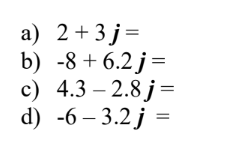
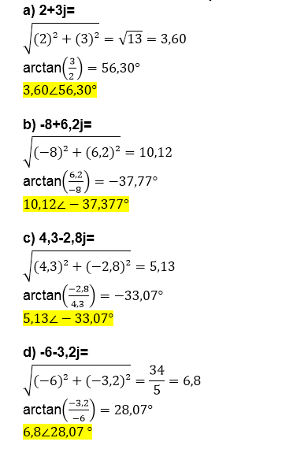
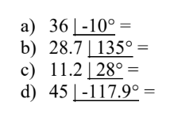
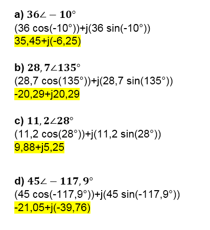
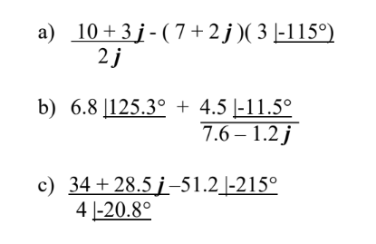
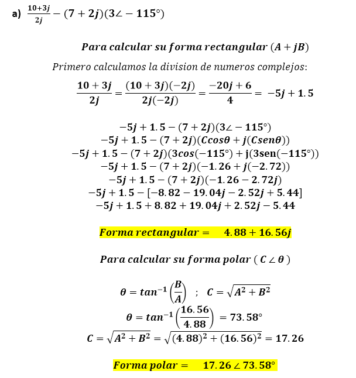
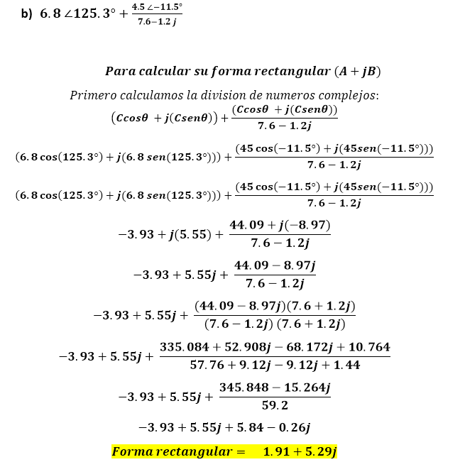
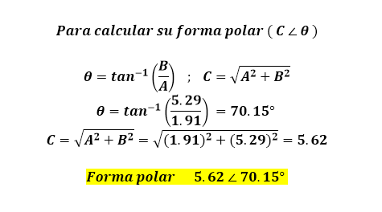
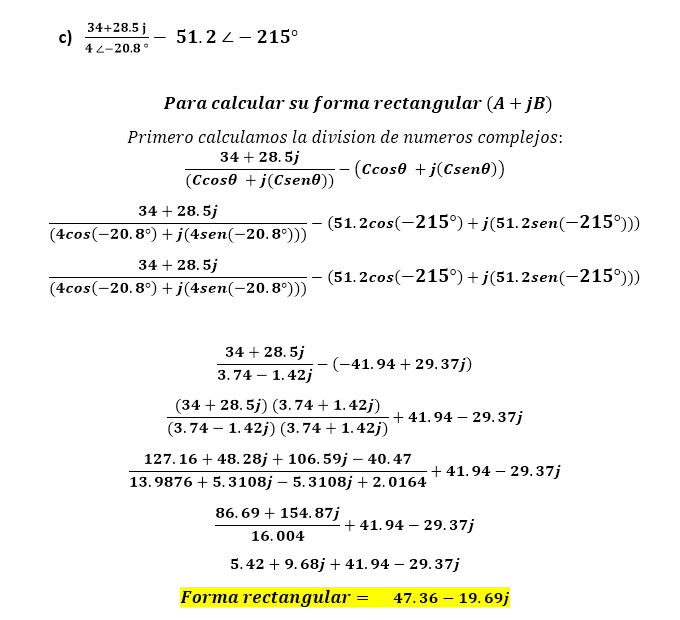
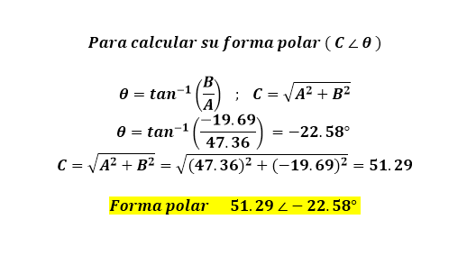

InformeLaboratorioNo9
==========================
# PRÁCTICA No. 9 FASORES 
1. OBJETIVOS
* 1.1 OBJETIVO GENERAL

Realizar operaciones aritméticas con números complejos, tanto en su forma polar como rectangular.

2. INFORMACION GENERAL 

Los números complejos permiten realizar operaciones matemáticas con cantidades fasoriales y son muy útiles en el análisis de circuitos de ca. Con el sistema de los números complejos se puede sumar, restar, multiplicar y dividir cantidades que tienen tanto magnitud como ángulo.

3. MATERIAL Y EQUIPO REQUERIDO

- Calculadora cientifica.

4. PROCEDIMIENTO

### 9.1 Transforme a su forma polar:

 
  

### 9.2 Transforme a su forma rectangular.

 
  

### 9.3 Realice las siguientes operaciones paso a paso, y represente el resultado tanto en su forma rectangular como en su forma polar.

 
  
   
    
     
      
    
   
### 9.4 Resuelva las operaciones anteriores por medio de la calculadora y compare resultados.

5. VIDEO

6. CONCLUSIONES

 - Se pudo comprobar que los valores obtenidos mediante las formulas y la calculadora cientifica coinciden.
Asi mismo tanto para las tablas obtenidas, se comprobó las formulas para cada literal, los cálculos obtenidos nos asemejan a una silmulación real, todo este proceso de usar la ley antes mencionadas nos permiten a que los valores sean precisos y casi exactos.

7. BIBLIOGRAFIA

 Floyd Thomas L, “Principios de Circuitos Eléctricos”, 8 ed. 2007 .Pearson Educación de México, S.A. de C.V. México, pp. 281-333.
 
